# Indic MMLU — Benchmarking Open-Source LLMs on Indian Languages

A rigorously prepared, multi-language adaptation of the CAIS/MMLU test set, translated and enhanced for **22 Indic languages**, designed to evaluate open-source LLMs’ real-world ability to understand Indian languages.
We additionally conducted large-scale **evaluation on 16 of these Indic languages (plus English)**, producing detailed accuracy reports and per-language visualizations.

---

# Open Source Release 
[Click here to view Release](https://github.com/anonymous-submitter0104/iclr-submission/tree/ebd3accac49c6f0c4441ef5fd2691322e26da4d8/opensource-release/Indic%20MMLU)

---
# Table of Contents

1. [Overview](#overview)
2. [Why the Need for Indic MMLU](#why-the-need-for-indic-mmlu)
   - [Data Distillation for Indian Languages](#data-distillation-for-indian-languages)
   - [The Role of Indic MMLU](#the-role-of-indic-mmlu)
3. [What This Dataset Has on Offer](#what-this-dataset-has-on-offer)
4. [Coverage](#coverage)
5. [High-Level Pipeline](#high-level-pipeline-what-we-did)
   - [Indic MMLU Construction Algorithm](#indic-mmlu-construction-algorithm)
6. [Translation Algorithm](#translation-algorithm)
7. [Reproducible Commands](#reproducible-commands-examples)
   - [Translate](#translate)
   - [Enhance Translations (LLM-based)](#enhance-translations-llm-based)
   - [Generate Embeddings](#generate-embeddings)
   - [Cosine Similarity](#cosine-similarity-english-vs-translated-enhancements)
   - [Linguist / Teacher Rating](#linguist--teacher-rating-llm-assisted-orchestration)
   - [Model Evaluation with `lm-eval`](#model-evaluation-with-lm-eval)
8. [Summary of LLM-as-Judge Ratings](#summary-of-llm-as-judge-ratings)
9. [Cosine Similarity](#cosine-similarity)
10. [Model Evaluation Methodology](#model-evaluation-methodology)
11. [Important Note](#important-note)
12. [Indic MMLU Results](#indic-mmlu-results)
13. [How to Reproduce (Quick Checklist)](#how-to-reproduce-quick-checklist)
14. [Best Practices & Caveats](#best-practices--caveats)
15. [Visual Assets & Tables](#visual-assets--tables)

---

## Why the Need for Indic MMLU

The rise of large language models (LLMs) has enabled advanced **synthetic data generation**, including:

* Building LLM-based frameworks for **data curation and sandboxing**
* Generating reasoning and coding examples in non-English languages
* Creating SFT datasets, as well as off-policy datasets for **RLHF, DPO, GRPO**-style training

To fully leverage these capabilities for Indian languages, we need LLMs with at least **limited native proficiency** in these languages. Such models allow us to generate high-quality, culturally-aligned datasets, create virtual personas to introduce nuanced constructs, and maintain **full control and flexibility** over the synthetic data pipeline.

### Data Distillation for Indian Languages

Data distillation provides a practical approach to achieve this:

* **Easier and cleaner access to world knowledge** from state-of-the-art LLMs
* **Domain control and flexibility** to shape datasets according to cultural and linguistic requirements
* Embedding **strong Indian values** into datasets more effectively than via custom pipelines
* Creating safety datasets that mitigate **anti-Indian stances** and promote positive responses

**Distillation** is the process of generating data from large models to produce **task-specific, high-quality, and culturally-aligned datasets**. Using distillation, we can apply various synthetic data augmentation strategies, such as:

* Chain-of-Thought (CoT) reasoning
* Multi-turn conversational setups for richer data
* Summaries and diverse QA pairs
* Incorporation of strong Indian values through **virtual Indian personas**
* Other augmentations, including translations and language-specific refinements

### The Role of Indic MMLU

Before deploying LLMs for such Indian-language data generation, we first need to **evaluate their cross-lingual knowledge transfer capabilities**. Indic MMLU serves this purpose by providing a benchmark to test how well models understand Indian languages, rather than merely translating English content.

While previous efforts have translated MMLU into Indian languages, none have **released their methodology**. Indic MMLU is the first benchmark to provide:

* **Open recipe and open code** for translations
* Coverage of **22 Indian languages**
* A fully transparent and **reproducible evaluation setup**

This ensures that models can be assessed rigorously for genuine Indian-language understanding, forming a **foundation for culturally-aware synthetic data pipelines** in future research.

---

## What this dataset has on offer

Large language models are often benchmarked only on English datasets, which leaves open the question of whether they can *actually* understand Indian languages beyond surface-level translation.

The **Indic MMLU dataset** bridges this gap by:

* Translating the widely used **[CAIS/MMLU](https://huggingface.co/datasets/cais/mmlu) benchmark** into **22 Indian languages**.
* Enhancing those translations with high-quality open-source LLM refinement.
* Providing a reproducible evaluation setup for **measuring open-source models across 16 Indic languages (evaluated subset)**.

If a model’s score on an Indic version is close to its score on the original English MMLU, it indicates **genuine language understanding** and strong cross-lingual generalization.

---

## Coverage

* **Dataset scope:** 22 Indic languages (full benchmark availability).
* **Evaluation scope:** 16 Indic languages + English (practically evaluated with ~24 open-source LLMs).

This separation ensures the dataset is **broad and inclusive**, while evaluation focuses on the languages with the most immediate support and resources.

---

## Overview

* **Source benchmark:** CAIS/MMLU (general knowledge QA benchmark).
* **Target:** 22 Indic languages + English (translated test set).
* **Workflow:** Machine translation → LLM-based translation enhancement → embedding comparison → Persona based LLM-as-judge Scores → Correlation between Embeddings and LLM as Judge → human/linguist rating and automated evaluation.
* **Deliverables:** Enhanced translated `.jsonl` datasets, per-language embeddings, cosine similarity reports, teacher/linguist ratings, model evaluation scores and visualizations (radar plots).

---

## Key principles applied

1. **Preserve semantic parity:** Questions remain semantically the same as English; only language changes.
2. **Quality control:** Model-Based Automated checks (embeddings, math correctness) + human linguist ratings.
3. **Reproducibility:** Dockerized inference environment, scriptable pipeline, and clear CLI commands.
4. **Transparency:** We provide similarity metrics to demonstrate translation fidelity and teacher ratings to highlight linguistic quality.

---

## High-level pipeline (what we did)

1. **Translate** the CAIS/MMLU test set to each Indic language using *IndicTrans2* (baseline MT).
2. **Enhance** those translations using an open-source LLM with task-specific instructions (to correct phrasing, clarify ambiguous translations, preserve math expressions, and maintain answer choices alignment).
3. **Embed** both the original English items and the (enhanced) translated items with the same embedding model.
4. **Compare** embeddings using cosine similarity to measure semantic closeness.
5. **LLM as Judge and Human review**: linguists/teachers rated samples for language quality, math correctness, and coherence.
6. **Evaluate models**: run ~24 open-source LLMs across all languages using the lm-eval framework and visualize results (radar plots, top-3 per language).

---

## Indic MMLU Construction Algorithm

To complement the pseudo-code, the following flowchart provides a **visual overview of the Indic MMLU pipeline**. It clearly illustrates the step-by-step workflow, starting from the English MMLU dataset and moving through translation, enhancement, evaluation, and validation:

* **Translation Stage:** The English MMLU instance is translated into Indic languages using specialist MT.
* **Enhancement Stage:** Translations are refined with large-scale LLMs for improved fluency and alignment.
* **LLM Based Judging Phase:** Three types of evaluation are conducted — *fluency by native language experts, subject correctness by domain experts, and alignment by coherence judges*.
* **Validation Stage:** Embedding similarity checks, n-gram metrics (BLEU, ROUGE, ChrF++), and discrepancy detection ensure quality.
* **Final Output:** A validated Indic MMLU dataset instance ready for benchmarking.

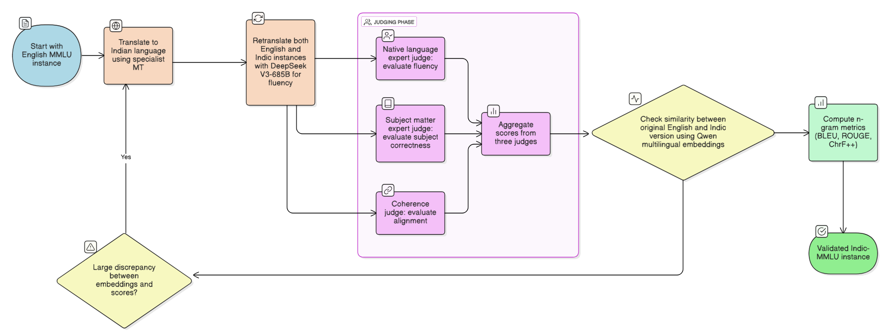

# Translation Algorithm 

```
Input:
  original_mmlu
  target_languages
  instructions

For each language L in target_languages:
    translated = translate(original_mmlu, tgt=L)
    enhanced = enhance_using_llm(translated, instructions)

    eng_emb = embed(original_mmlu)
    trans_emb = embed(enhanced)
    sim_scores = cosine_similarity(eng_emb, trans_emb)

    llm_scores = LLM_as_Judge(original_mmlu, translated)

    consistency = consistency_check(sim_scores, llm_scores)

    If consistency is poor:
        human_ratings = rate_sample(enhanced)
    Else:
        accept enhanced

Aggregate all scores:
    combine sim_scores, llm_scores, human_ratings
    compute per-language model scores

Produce visualizations:
    generate charts and plots for cross-language comparison

Output:
    per-language evaluation scores
    visualizations

```

This visual representation makes it easier to understand how the **algorithmic steps, human evaluation, and automated checks** come together to ensure translation quality and dataset reliability.

---

## Reproducible commands (examples)

> These are the canonical commands used in our pipeline. Replace file paths, ports, and concurrency values as appropriate for your environment.

**Translate**

```bash
python3 trans_mmlu.py \
  --input_file_path test-00000-of-00001_with_ids.jsonl \
  --output_file_path mmlu_kn_in.jsonl \
  --tgt_lang "kn" \
  --src_lang "en"
```

**Enhance translations (LLM-based)**

```bash
python3 async_infr.py \
  --input-path mmlu_as_in.jsonl \
  --output-file ds_enhance_eval_hi.jsonl \
  --instruction-path instruction_prompts.yml \
  --task deepseek_enhance_instruct \
  --template-fields 'og_question' 'og_choices' 'question' 'answer' 'Hindi' \
  --max-concurrency 4096 \
  --backend sglang-oai-chat \
  --extra-request-body '{"temperature":0.7,"top_p":0.9,"top_k":50,"max_tokens":1024}' \
  --port 30000
```

**Generate embeddings**

```bash
python3 get_embeddings.py \
  --input-file test-00000-of-00001_with_ids.jsonl \
  --output-file mmlu_qwen3_embd.jsonl \
  --server-url http://127.0.0.1:30000 \
  --concurrency 4096
```

**Cosine similarity (English vs translated enhancements)**

```bash
python3 calculate_cosine_similarity.py \
  --input_dir deepseek_enhance \
  --output_dir mmmlu/similarity/cosine/enhance/deepseek_enhance \
  --english_file mmlu_eng.jsonl
```

**Linguist / teacher rating (LLM assisted orchestration)**

```bash
python3 async_infr.py \
  --input-path mmlu_as_in.jsonl \
  --output-file ds_enhance_eval_as_qwen3_instruct.jsonl \
  --instruction-path instruction_prompts.yml \
  --task rate_translated_text_linguist \
  --template-fields 'og_question' 'og_choices' 'enhanced_text' 'Assamese' \
  --max-concurrency 4096 \
  --backend sglang-oai-chat \
  --extra-request-body '{"temperature":0.7,"top_p":0.9,"top_k":50,"max_tokens":1024}' \
  --port 30000
```

**Model evaluation with `lm-eval`**

```bash
# Example wrapper which runs evaluation for a model snapshot against the Indic MMLU dataset
bash lm-eval-llm.sh /path/to/model_snapshot /benchmark-result-path
```

---

### Summary of LLM-as-Judge Ratings

To evaluate translation quality systematically, we employed **LLMs as judges**, operating under three carefully designed expert personas:

* **Math Expert Persona** → Rated mathematical correctness, terminology, and conceptual fidelity.
* **Linguistic Expert Persona** → Assessed fluency, grammar, idiomatic usage, and naturalness of the translation.
* **Coherence Expert Persona** → Evaluated semantic alignment, logical flow, and clarity between English and the target language.

**What we measured:**

* Language quality, fluency, and linguistic suitability.
* Mathematical correctness and fidelity of technical content.
* Overall coherence and semantic alignment with the English source.

| Language  | Avg Maths Rate | Avg Coherence Rate | Avg Linguist Rate | Total Records |
|-----------|----------------|--------------------|-------------------|---------------|
| Hindi	    | 9.658029	     | 9.722054	          | 9.667891	        | 14042         |
| Bengali	  | 9.182561	     | 9.131505	          | 8.202293	        | 14042         |
| Nepali    | 9.473793       | 9.331505           | 8.402293          | 14042         |
| Telugu    | 9.220837       | 8.975929           | 7.986256          | 14042         |
| Oriya     | 9.264421       | 8.944096           | 8.220268          | 14042         |
| Punjabi   | 9.348027       | 9.049138           | 8.253454          | 14042         |
| Assamese  | 9.147201       | 9.039097           | 8.133243          | 14042         |
| Sanskrit  | 8.338485       | 8.112520           | 6.390115          | 14042         |
| Kannada   | 9.322746       | 9.111736           | 8.131819          | 14042         |
| Sindhi    | 2.070645       | 3.109956           | 2.478137          | 14042         |
| Gujrati   | 9.260647       | 9.206523           | 8.368965          | 14042         |
| Marathi   | 9.301951       | 9.342045           | 8.381926          | 14042         |
| Tamil     | 9.047856       | 9.042943           | 8.071144          | 14042         |
| Malayalam | 9.134952       | 8.998148           | 7.956488          | 14042         |
| Maithili  | 9.263282       | 9.118146           | 8.218772          | 14042         |

**How to read the table:**

* Ratings are on a **1–10 scale**, where higher scores reflect better translation and enhancement quality.
* Most languages achieved **consistently high averages (>8.9)**, showing strong quality after enhancement.
* A few outliers suggest areas where further targeted refinement may be beneficial.

---

## Cosine similarity 

* Cosine similarity gives a quick automated signal of semantic closeness between the translated/enhanced items and their English originals.
* Typical mean similarities range from ~0.76 to 0.85 across languages; higher means closer embeddings (better semantic preservation).
* Use the similarity scores as a triage: low similarity → manual review; high similarity → likely semantically faithful.

| Language               | Mean Similarity | Std Similarity | Min Similarity | Max Similarity |
|-------------------------|-----------------|----------------|----------------|----------------|
| mmlu_as_in_qwen3_embed  | 0.8045          | 0.0597         | 0.4644         | 1              |
| mmlu_bn_in_qwen3_embed  | 0.8133          | 0.0504         | 0.5276         | 1              |
| mmlu_gu_in_qwen3_embed  | 0.8211          | 0.0535         | 0.4016         | 1              |
| mmlu_hi_in_qwen3_embed  | 0.8472          | 0.0489         | 0.3688         | 1              |
| mmlu_kn_in_qwen3_embed  | 0.8106          | 0.0565         | 0.4660         | 1              |
| mmlu_mai_in_qwen3_embed | 0.8226          | 0.0504         | 0.4936         | 1              |
| mmlu_ml_in_qwen3_embed  | 0.8158          | 0.0531         | 0.5109         | 1              |
| mmlu_mr_in_qwen3_embed  | 0.8129          | 0.0513         | 0.5281         | 1              |
| mmlu_ne_in_qwen3_embed  | 0.8242          | 0.0502         | 0.4802         | 1              |
| mmlu_or_in_qwen3_embed  | 0.8159          | 0.0555         | 0.4684         | 1              |
| mmlu_pa_in_qwen3_embed  | 0.8246          | 0.0516         | 0.5450         | 1              |
| mmlu_sa_in_qwen3_embed  | 0.7912          | 0.0574         | 0.4981         | 1              |
| mmlu_sdd_in_qwen3_embed | 0.7646          | 0.0735         | 0.3633         | 0.9676         |
| mmlu_ta_in_qwen3_embed  | 0.7964          | 0.0559         | 0.5242         | 1              |
| mmlu_te_in_qwen3_embed  | 0.8006          | 0.0524         | 0.5379         | 1              |

---

## Model Evaluation Methodology

We evaluated **~24 open-source LLMs** across **16 Indic languages** (subset of the 22 total dataset languages) plus English, using the Indic MMLU benchmark.

Workflow:

1. **Environment Setup:** Dockerized `vllm/vllm-openai` for reproducibility.
2. **Framework:** `lm-eval` for standardized evaluation.
3. **Metrics:** per-language accuracy, top-3 rankings per language, aggregate averages.
4. **Visualization:** radar plots for each language and comparative top-3 plots.

---

## Important Note

* **Indic MMLU Dataset = 22 Indian languages**
* **Current Model Evaluation = 16 Indian languages + English**
* Work is ongoing to expand the evaluation to cover all 22 languages.

---
### Indic MMLU Results 

| <div align="center">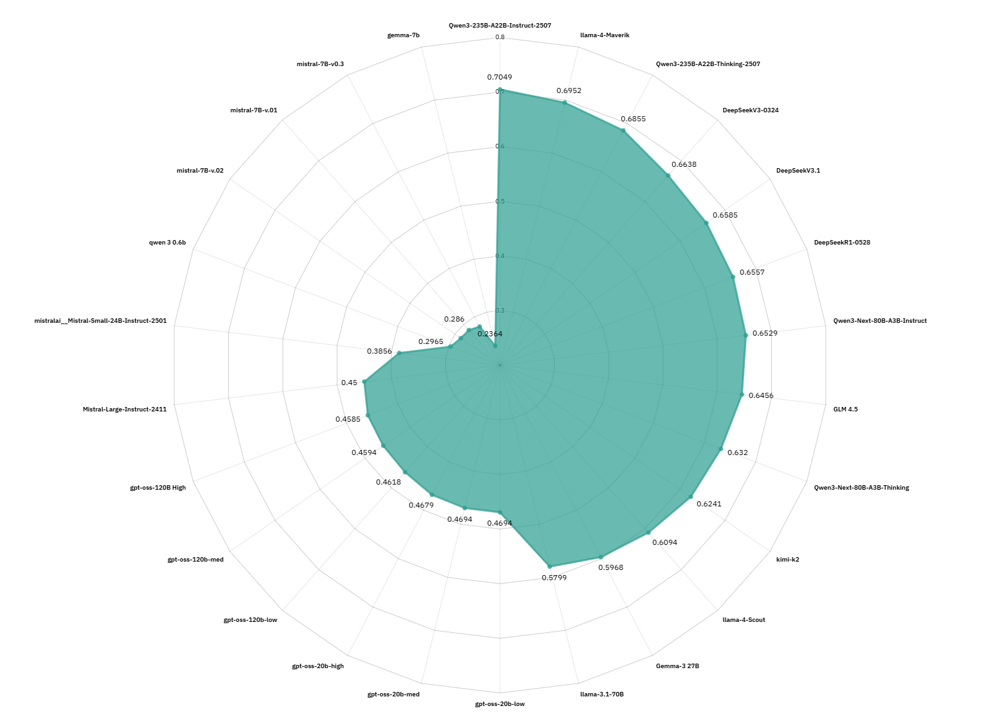<br/>*Assamese*</div> | <div align="center">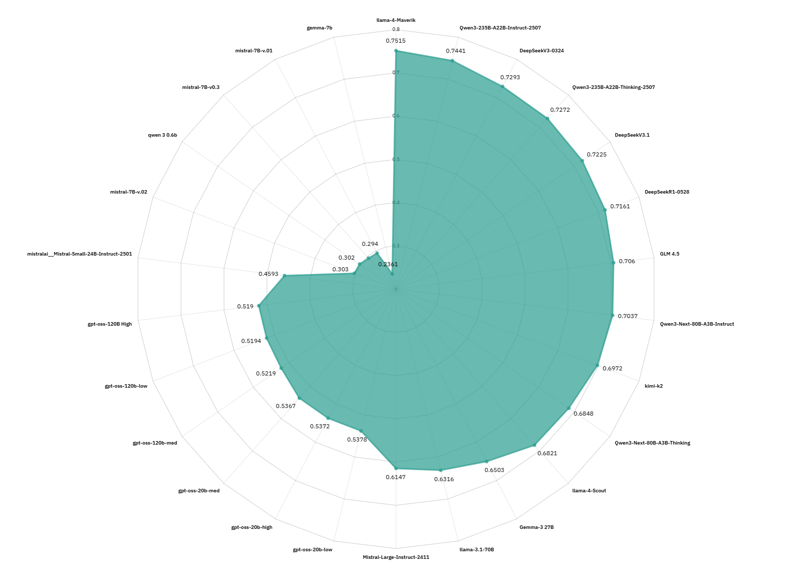<br/>*Bengali*</div> |
|---------------------------------------------------------------------------|------------------------------------------------------------------------|
| <div align="center">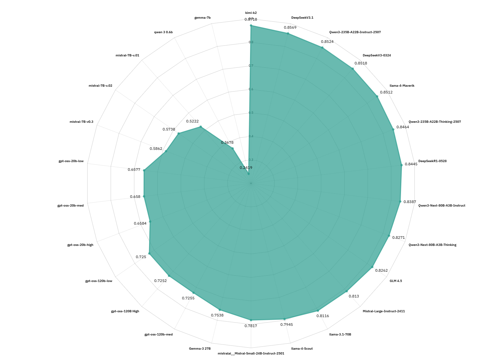<br/>*English*</div>    | <div align="center">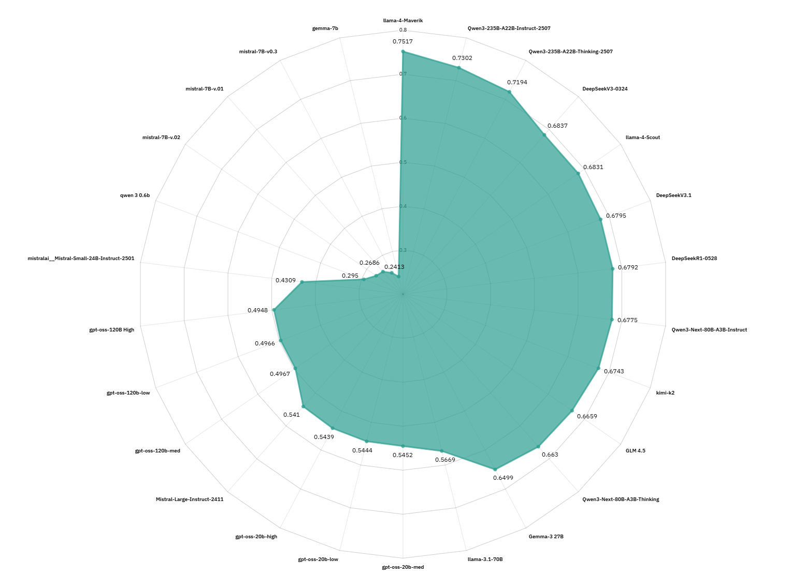<br/>*Gujarati*</div> |
| <div align="center">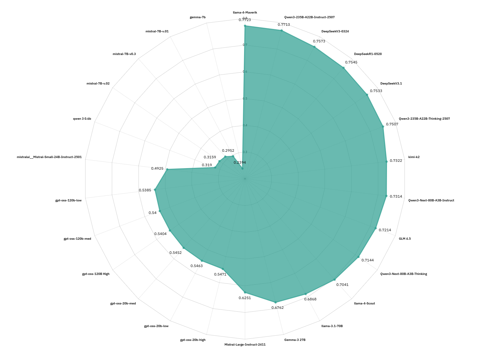<br/>*Hindi*</div>          | <div align="center">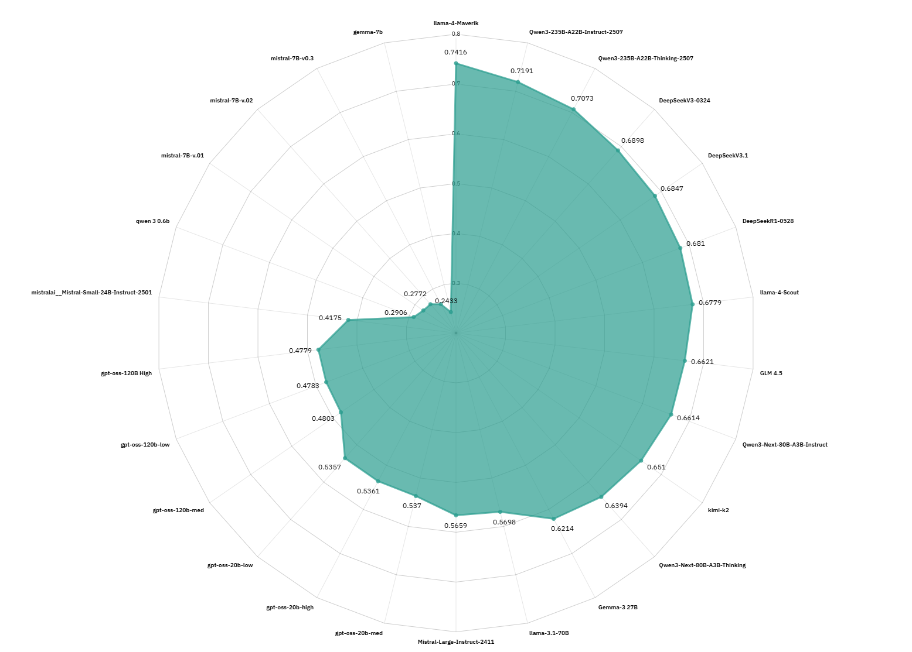<br/>*Kannada*</div> |
| <div align="center">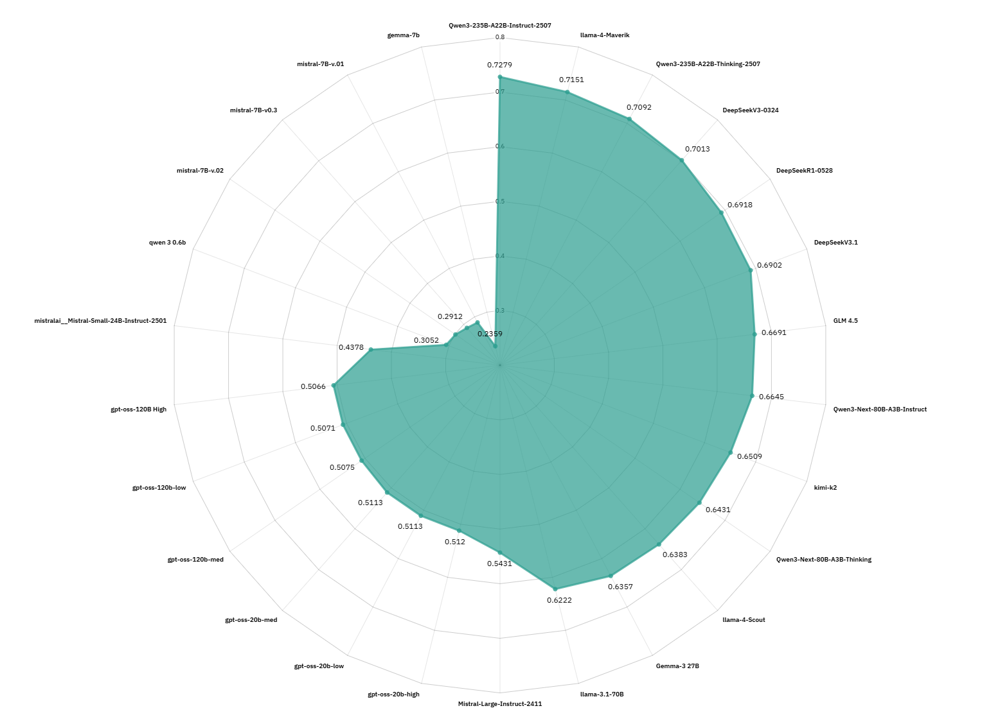<br/>*Maithili*</div> | <div align="center">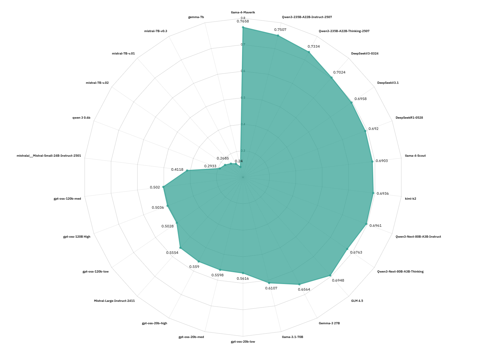<br/>*Malayalam*</div> |
| <div align="center"><br/>*Marathi*</div>    | <div align="center">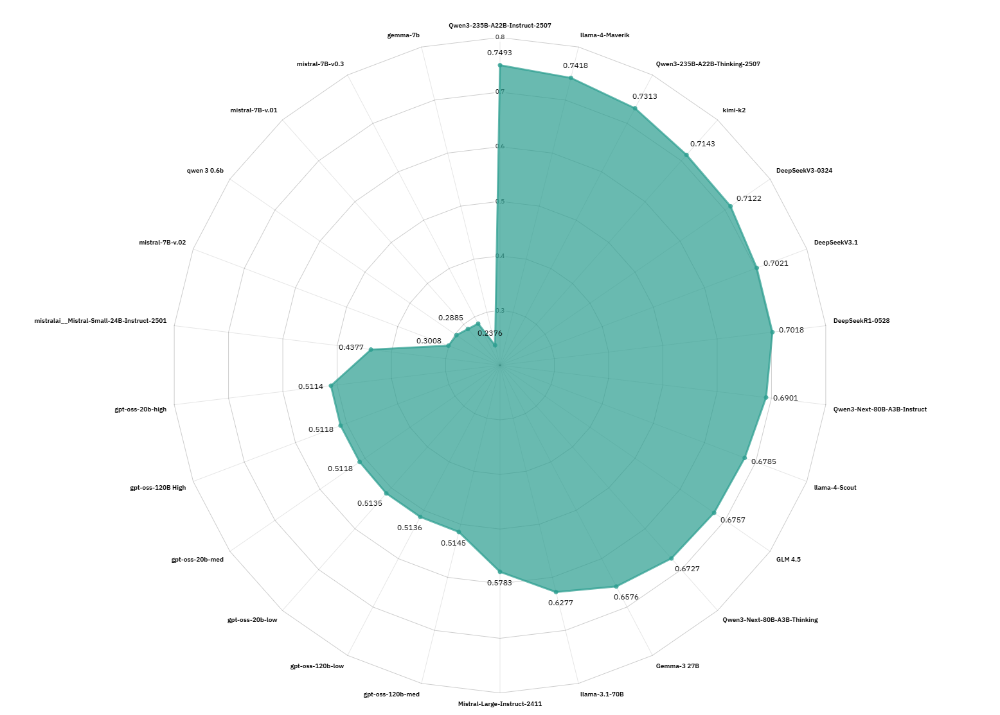<br/>*Nepali*</div>   |
| <div align="center">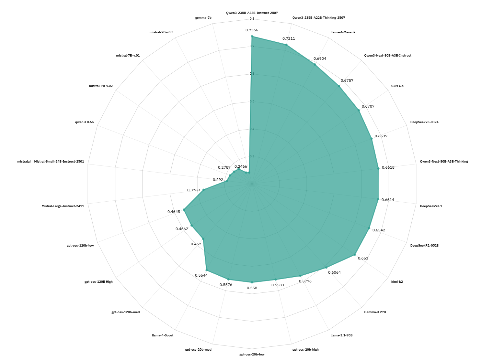<br/>*Oriya*</div>          | <div align="center">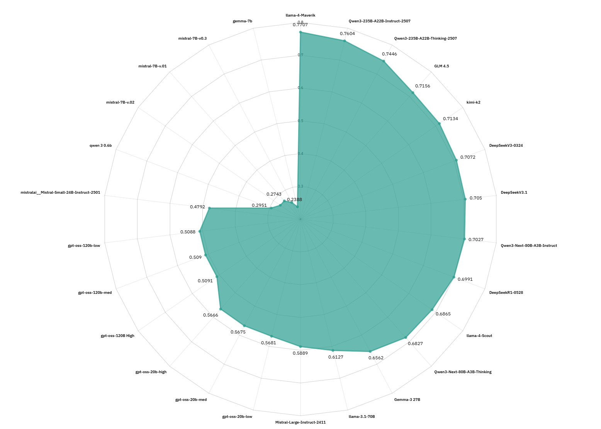<br/>*Punjabi*</div> |
| <div align="center">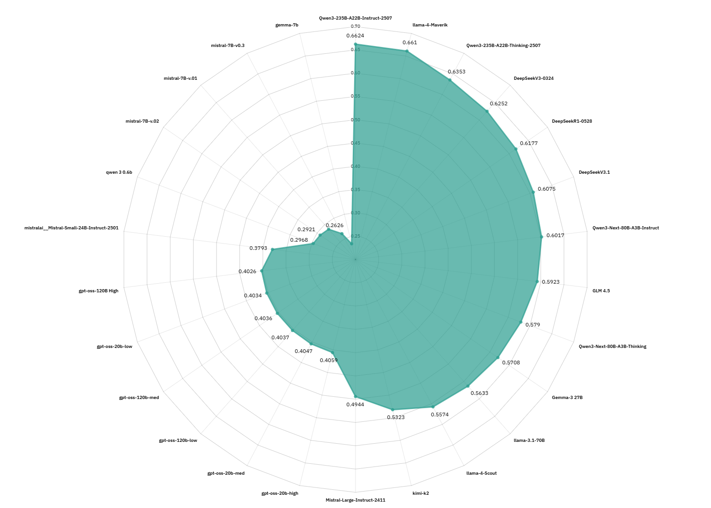<br/>*Sanskrit*</div> | <div align="center">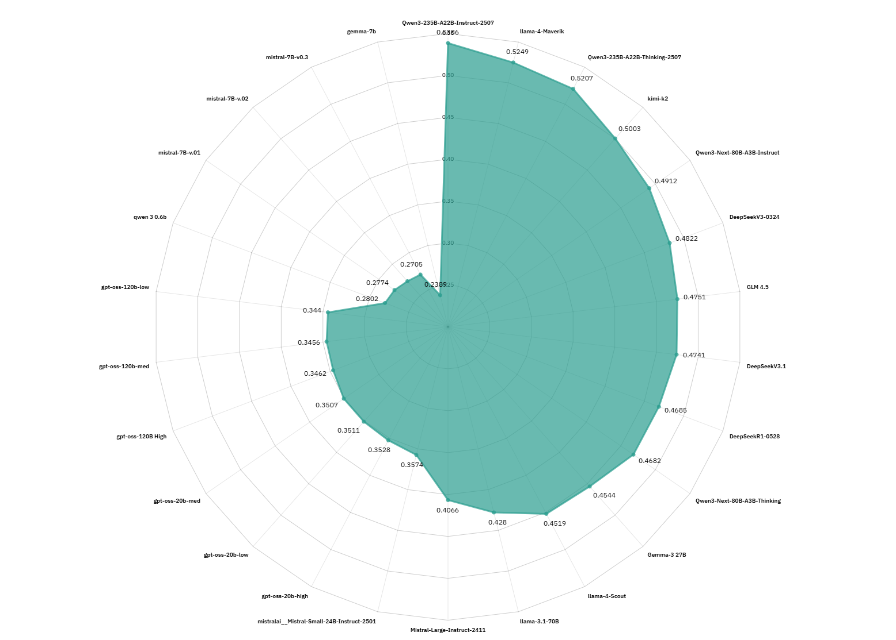<br/>*Sindhi*</div>   |
| <div align="center"><br/>*Tamil*</div>          | <div align="center">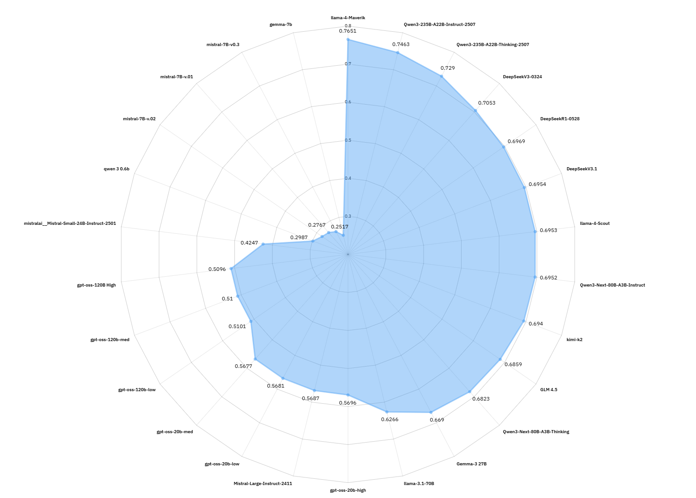<br/>*Telugu*</div>   |


---

## How to reproduce (quick checklist)

1. Prepare the English CAIS/MMLU test set (`.jsonl` with IDs).
2. Run `trans_mmlu.py` to produce per-language MT outputs.
3. Run `async_infr.py` with the enhancement task to obtain human-readable improved translations.
4. Generate embeddings for both English and enhanced translations.
5. Run `calculate_cosine_similarity.py` to produce similarity reports.
6. Optionally run human/linguist rating orchestration for additional quality assessment.
7. Evaluate models with `lm-eval` and generate visualizations.

---

## Best practices & caveats

* **Math and formatting:** preserve mathematical expressions and numerals during translation—these are critical for correctness.
* **Choice alignment:** ensure answer choices remain in the same order and map to the same ground-truth labels.
* **Human review:** automated metrics are helpful but not sufficient; include periodic linguist sampling.
* **Constrained inference:** use deterministic LLM settings for enhancement (lower temperature, consistent decoding) to reduce hallucination.

---

## Visual assets & tables

We include per-language radar plots and a consolidated results panel in `plots/`. The README in the repo contains thumbnails; click through for full-resolution visuals. 

---
